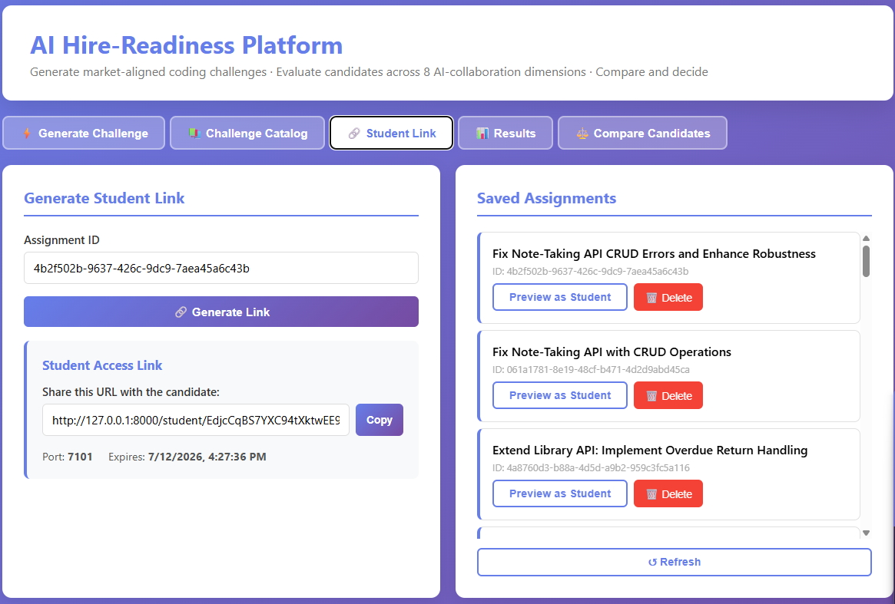

# hire-signal

> AI-powered hire-readiness evaluation platform — assess candidates on real-world AI-assisted coding competency, not just algorithmic recall.


---

## What is hire-signal?

Coding interviews have changed. Candidates now use AI tools on the job — and the best ones know *how* to collaborate with AI effectively, not just write code from scratch. hire-signal evaluates that skill.

Employers post a challenge. Candidates solve it in an isolated browser-based VS Code environment with Gemini CLI access. The platform records every Gemini interaction, extracts the final workspace, and evaluates the candidate across **8 AI-collaboration dimensions** — producing a structured hire recommendation.

> **AI Beta Notice:** Scores are experimental signals. Human judgment holds final authority. Always review before making hiring decisions.

---

## Screenshots

### Employer — Challenge Creation

| Challenge Generation | Challenge Catalog | Candidate Link Generated |
|---|---|---|
|  |  |  |

### Candidate Experience


### Employer — Results & Scoring

| Candidate List | 8-Dimension Radar Chart | Recruiter Scoring View |
|---|---|---|
|  |  |  |

| Score Rationale | AI Feedback | AI Session Log (Recruiter View) |
|---|---|---|
|  |  |  |


### Employer — Compare Candidates

| Candidate Comparison (1) | Candidate Comparison (2) |
|---|---|
|  |  |

---

## How It Works

```
Employer creates challenge
        ↓
Generates unique link per candidate
        ↓
Candidate codes in isolated Docker container
(browser VS Code + Gemini CLI access)
        ↓
On submit: full workspace snapshot + AI session transcript extracted
        ↓
8-dimension evaluation via Gemini
        ↓
Hire recommendation: strong_hire / hire / select / pass
        ↓
Employer compares candidates side-by-side, flags/overrides as needed
```

---

## 8-Dimension Scoring Framework

| # | Dimension | Weight | What It Measures |
|---|-----------|--------|-----------------|
| PD | Problem Decomposition | 15% | Did the candidate break the problem into logical sub-problems before diving in? |
| FP | First-Principles Thinking | 15% | Did they reason from fundamentals vs. copy-paste AI output blindly? |
| CP | Creative Problem Solving | 10% | Novel approaches, non-obvious solutions |
| IQ | Iteration Quality | 15% | How well did they refine and improve with each AI interaction? |
| DA | Debugging with AI | 15% | Did they diagnose root causes or just ask AI to fix errors? |
| AD | Architecture Decisions | 10% | Code structure, separation of concerns, maintainability choices |
| CC | Communication Clarity | 10% | Quality of prompts and how clearly they directed the AI |
| TE | Token Efficiency | 10% | Got good results without excessive back-and-forth |

### Hire Thresholds

| Recommendation | Score |
|---|---|
| ⭐ Strong Hire | ≥ 85 |
| ✅ Hire | ≥ 70 |
| 🟡 Select | ≥ 55 |
| ⛔ Pass | < 55 |

Thresholds are **Python-enforced** — the LLM's own claimed composite/recommendation is always discarded and recomputed from the raw per-dimension scores. See `_bmad-output/implementation-artifacts/deferred-work.md` for one known edge case where the composite display and recommendation can briefly disagree near a boundary.

---

## Challenge Types

| Type | Description |
|---|---|
| `feature_extension` | Partial working implementation — candidate adds a specified feature |
| `bug_fix` | Working code with intentional hidden bugs — candidate must find and fix |
| `refactoring` | Messy but correct code — candidate improves structure without changing behaviour |
| `optimization` | Correct but slow code — candidate improves performance against a benchmark |

### Skill Areas

`api_integration` · `rate_limiting` · `llm_usage` · `server_monitoring` · `data_pipeline` · `game_logic`

### AI Assistance Modes

- **Unguarded** — Gemini can give full solutions. Employer assesses *how* the candidate uses AI.
- **Guarded** — governed AI availability, not a hard block (HackerRank-style): Gemini CLI is asked (via a read-only bind-mounted `~/.gemini/GEMINI.md`) to redirect an unqualified "solve it for me" with a diagnostic question, allow short targeted code only once the candidate states their own hypothesis, and never volunteer more than one issue per response. **Enforcement of the wording itself is honor-system** — a candidate with shell access can relocate `$HOME` to dodge the mounted file; the mounted file itself is kernel-enforced read-only. Accepted as current scope; see `docs/PROJECT_REQUIREMENTS.md`.

---

## Features

- **AI challenge generation** — describe a scenario, get a market-aligned coding challenge with starter code and evaluation rubric
- **Per-challenge dimension applicability** — the generator declares which of the 8 dimensions a given challenge can actually produce evidence for (e.g. a pure-correctness bug fix has no real architecture decision to score); the composite is renormalized over only the applicable dimensions instead of averaging in one the challenge never offered
- **Optional decision-point challenges** — a genuine design trade-off (two named approaches, no verdict) baked into the challenge itself; the candidate implements one and justifies it in `DECISION.md`, which flows into scoring as ordinary workspace evidence
- **Challenge catalog** — review, publish, and reuse challenges across assessments; 10 curated challenges seeded across the type/skill matrix
- **Isolated candidate environments** — one Docker container per candidate with browser VS Code + Gemini CLI (graceful degradation without Docker — links still generate)
- **Full workspace capture** — entire `/workspace` extracted before container cleanup, with a text-only filter and 50KB cap
- **AI conversation timeline** — the candidate's real Gemini CLI session transcript (prompts, responses, file-change counts) is captured and shown to the employer alongside the score, not just the final code
- **Raw AI token-usage telemetry** — mode-stamped, informational-only token count per submission, displayed next to the scored Token Efficiency dimension — never a gate, never folded into the composite
- **8-dimension evaluation** — single Gemini call scores all dimensions with per-dimension rationales; all 8 keys always present even on a partial LLM response; a scoring failure is flagged for manual review rather than silently rendered as a real 0
- **Employer dashboard** — 5-tab UI: Generate · Catalog · Link · Results · Compare
- **SVG radar chart** — visual 8-dimension profile per candidate
- **Side-by-side comparison** — overlaid radar + butterfly chart for two candidates
- **Human override & flag workflow** — flag any submission for review; override any hire recommendation with a required rationale; every override/flag permanently logged to an append-only calibration table
- **Visibility floor** — un-evaluated candidates always sort last, never hidden
- **Employer preview** — see the candidate-facing view of a challenge without spinning up Docker
- **199-test suite** — 8-dimension scoring, dimension applicability, workspace extraction, hire-threshold boundaries, candidate ranking, session-log/token-usage capture, and challenge generation, all runnable with no LLM key or Docker daemon

---

## Quick Start

### Prerequisites

- Python 3.11+
- [uv](https://docs.astral.sh/uv/getting-started/installation/) — fast Python package/venv manager (`pip install uv` if you don't have it, or see the install link)
- A [Gemini](https://aistudio.google.com/apikey) API key (LLM calls are routed through the Gemini API)
- Docker (**optional** — the app runs and the employer dashboard is fully usable without it; only live candidate containers require it)

### Setup

```bash
git clone https://github.com/kunalg06/hire-signal.git
cd hire-signal

# Create an isolated virtual environment
uv venv

# Install the EXACT dependency versions this project was built/tested against
# (requirements.txt is fully pinned via `uv pip freeze` — this is what keeps a
# `git pull` later from silently picking up a newer, untested package version)
uv pip sync requirements.txt --python .venv

# Configure environment
echo "GEMINI_API_KEY=your-gemini-key-here" > .env

# Run the platform (Windows)
.venv\Scripts\python.exe run.py
# Run the platform (macOS/Linux)
.venv/bin/python run.py
```

Open `http://localhost:8000` in your browser.

> If `uv pip sync` fails with a TLS/certificate error (common behind a corporate antivirus that intercepts HTTPS, e.g. Norton's SSL-scanning proxy), retry with `uv pip sync requirements.txt --python .venv --system-certs` — this trusts your OS's own certificate store instead of uv's bundled one, which is not a security downgrade (unlike disabling verification), just a different valid trust source.

Adding/removing a dependency later: `uv pip install <package> --python .venv` (or uninstall), then regenerate the full pin with `uv pip freeze --python .venv > requirements.txt`.

### Running the test suite

```bash
.venv\Scripts\python.exe -m pytest tests/ -v   # Windows
.venv/bin/python -m pytest tests/ -v           # macOS/Linux
```

199 tests, no API key or Docker daemon required — every LLM/Docker call is mocked.

### Running the performance benchmark

```bash
.venv\Scripts\python.exe scripts/benchmark.py   # Windows
.venv/bin/python scripts/benchmark.py           # macOS/Linux
```

Real (non-mocked) numbers: SQLite throughput, Flask endpoint latency, and live Gemini API calls — requires `GEMINI_API_KEY`; Docker section auto-skips if the daemon isn't reachable. See [Performance Metrics](#performance-metrics-local-testing) below for the last measured run.

### Docker (for live candidate containers)

Build the candidate-container image and run the app normally — this is the actual dev path, **not** `docker-compose` (see `docs/ARCHITECTURE.md` for why `docker/docker-compose.yml` is a legacy/unused orchestration file in this codebase):

```bash
cd docker
docker build -f Dockerfile.codeserver -t coding-platform-student:latest .
cd ..
.venv\Scripts\python.exe run.py   # Windows
.venv/bin/python run.py           # macOS/Linux
```

---

## Employer Workflow

### 1. Generate a Challenge

```bash
POST /api/generate-challenge
{
  "problem_statement": "Build a rate limiter that throttles API requests per user",
  "challenge_type": "feature_extension",
  "skill_area": "rate_limiting",
  "difficulty": "medium",
  "ai_assistance_mode": "unguarded"
}
```

### 2. Publish to Catalog

```bash
POST /api/challenges/{challenge_id}/publish
```

### 3. Create an Assignment and Generate a Candidate Link

```bash
POST /api/assignments
{ "title": "...", "description": "...", "evaluation_criteria": "...", "starter_code": "...", "challenge_id": "..." }

POST /api/generate-link/{assignment_id}
# Returns link_id — share with candidate
```

### 4. Candidate Submits

Candidate accesses their isolated VS Code environment, works with Gemini, and submits. The platform captures the full workspace and starts evaluation in the background — the candidate's browser polls for results every 3 seconds.

### 5. View Results

```bash
GET /api/submission/{submission_id}
# Returns: composite_score, hire_recommendation, 8 dimension scores + rationales
```

### 6. Compare, Flag, and Override

```bash
GET /api/challenges/{challenge_id}/candidates?sort_by=composite_score&order=desc
# Ranked list, sortable by composite or any dimension, un-evaluated candidates always last

POST /api/submissions/{submission_id}/flag
{ "reason": "Suspicious timing pattern" }

POST /api/submissions/{submission_id}/override
{ "override_recommendation": "hire", "override_rationale": "Strong communication, coachable" }
```

---

## API Reference

| Method | Endpoint | Description |
|--------|----------|-------------|
| `POST` | `/api/generate-challenge` | Generate AI challenge (type, skill, mode) |
| `GET` | `/api/challenges` | List published challenges (filterable) |
| `GET` | `/api/challenges/{id}` | Get single challenge |
| `POST` | `/api/challenges/{id}/publish` | Publish to catalog |
| `DELETE` | `/api/challenges/{id}` | Soft-remove from catalog |
| `GET` | `/api/challenges/{id}/candidates` | Ranked candidates, sortable, dimension averages, visibility floor |
| `GET` | `/api/challenges/meta/options` | Valid enum values |
| `POST` | `/api/assignments` | Create assignment |
| `GET` | `/api/assignments` | List all assignments |
| `GET` | `/api/assignments/{id}` | Get assignment |
| `POST` | `/api/generate-link/{assignment_id}` | Generate candidate link |
| `POST` | `/api/submit-with-files/{link_id}` | Submit workspace for evaluation |
| `GET` | `/api/submission/{id}` | Get results (score, dimensions, hire verdict) |
| `POST` | `/api/submissions/{id}/flag` | Flag a submission for manual review |
| `POST` | `/api/submissions/{id}/override` | Override the AI hire recommendation |
| `GET` | `/api/analytics/overrides` | Override calibration analytics |
| `GET` | `/student/preview/{challenge_id}` | Employer preview of the candidate view (no Docker) |
| `GET` | `/api/system/health` | System health check |

Full documentation with request/response examples: [docs/API_REFERENCE.md](docs/API_REFERENCE.md)

---

## Project Structure

```
hire-signal/
├── app/
│   ├── routes/
│   │   ├── assignments.py      # Assignment CRUD + simple per-assignment candidate list
│   │   ├── challenges.py       # Challenge generation + catalog + full candidate ranking
│   │   ├── links.py            # Candidate link generation + container spin-up
│   │   ├── submissions.py      # Submission + 8-dim evaluation pipeline + flag/override
│   │   ├── student.py          # Candidate workspace portal + employer preview
│   │   ├── analytics.py        # Override calibration analytics
│   │   └── management.py       # System health & container management
│   ├── services/
│   │   ├── evaluation_service.py   # Gemini evaluation + challenge generation
│   │   ├── database_service.py     # All DB operations (raw SQL, no ORM)
│   │   ├── llm_service.py          # Gemini wrapper — the only LLM call surface
│   │   ├── docker_service.py       # Container lifecycle via subprocess `docker` CLI
│   │   ├── session_log_service.py  # Gemini interaction log parsing
│   │   └── management_service.py   # System monitoring
│   ├── models/
│   │   └── database.py         # SQLite schema (11 tables)
│   └── utils/
│       └── helpers.py          # ID generation, validation, rate limiting
├── templates/
│   └── frontend.html           # Employer dashboard (5-tab SPA, single file)
├── tests/                      # 199 pytest tests, no LLM key or Docker daemon required
├── docker/                     # Dockerfiles (Dockerfile.codeserver is the one that matters)
├── docs/                       # Architecture, API reference, requirements, folder structure
├── scripts/
│   └── seed_challenges.py      # Seeds 10 curated challenges
├── tools/
│   └── client.py               # Python SDK for API access
├── _bmad-output/               # Planning + implementation artifacts (epics, stories, deferred work)
├── AGENT.md                    # Session continuity for AI-assisted dev — read this first
├── CLAUDE.md                   # Dev guide: architecture constraints, debugging, customization
├── run.py                      # Flask entry point
└── requirements.txt             # Fully pinned dependency versions (`uv pip freeze` output)
```

---

## Database Schema

11 SQLite tables, auto-created on startup (`CREATE TABLE IF NOT EXISTS` + guarded `ALTER TABLE` migrations):

| Table | Purpose |
|---|---|
| `assignments` | Challenge definitions, optionally linked to a catalog challenge |
| `session_links` | Candidate links → containers |
| `submissions` | Submitted workspaces, with flag status |
| `submission_files` | Individual files per submission |
| `session_logs` | Gemini interaction log per session, including per-interaction token usage |
| `dimension_scores` | Per-dimension score + rationale per submission |
| `hire_evaluations` | Composite score + hire verdict (+ human override) |
| `challenges` | Challenge catalog (draft/published), including per-challenge dimension applicability + optional decision point |
| `comparison_sessions` | Saved side-by-side comparison views |
| `score_overrides` | Append-only human-override audit log |
| `flag_events` | Append-only flag-lifecycle audit log |

Full schema detail: [docs/ARCHITECTURE.md](docs/ARCHITECTURE.md)

---

## Environment Variables

```env
# Required
GEMINI_API_KEY=...

# Optional (defaults shown)
GEMINI_MODEL=gemini-2.5-flash
FLASK_ENV=development
PORT=8000
DB_PATH=data/assignments.db
DOCKER_HOST=                          # auto-detected
DOCKER_IMAGE=coding-platform-student:latest
SECRET_KEY=                           # auto-generated in dev
```

Note: candidate container ports (7100-7900) are a hardcoded constant in `app/config.py`, not an env var.

---

## Status

**All planned epics complete** as of July 2026 — challenge generation, 8-dimension scoring, candidate comparison and hiring workflow, employer dashboard, student experience, and test coverage. See `AGENT.md` for the current implementation snapshot and `_bmad-output/implementation-artifacts/deferred-work.md` for known, deliberately-deferred gaps (nothing blocking, all documented with file/line references).

---

## Human Override Policy

AI scores are one signal in a hiring decision, not the decision itself. The platform is designed around this principle:

- Hiring managers can flag and override any score
- Every override is logged for calibration in an append-only table — the original AI verdict is never modified
- **Visibility floor**: score affects rank only — all candidates remain visible regardless of score
- AI Beta banner is always shown on the employer dashboard

---

## Performance Metrics (Local Testing)

Measured with `python scripts/benchmark.py` — a real (non-mocked) benchmark against the actual Gemini API, real SQLite writes, and the real Flask routes via an isolated in-process test client. Raw results: `scripts/benchmark_results.json`. Run it yourself; these aren't estimates.

| Metric | Value |
|---|---|
| Challenge generation (`generate_challenge`, end-to-end, real Gemini call) | 10.2s mean · p50 10.9s · p95 13.1s |
| 8-dimension scoring (`score_8_dimensions`, end-to-end, real Gemini call) | 3.9s mean · p50 3.8s · p95 4.2s |
| Raw Gemini round-trip (minimal prompt, isolates network+model latency) | 1.2s mean · p50 1.0s · p95 2.2s |
| Candidate ranking endpoint, 30 candidates (`GET /api/challenges/<id>/candidates`) | 180ms mean · p50 177ms · p95 211ms |
| Challenge catalog list, 20 rows (`GET /api/challenges`) | 1.0ms mean |
| Assignment creation, write path (`POST /api/assignments`) | 4.0ms mean |
| SQLite full submission write (submission + 8 dim rows + hire eval) | 37.9ms mean |
| SQLite dimension-score read (8 rows) | 0.7ms mean |
| Docker student-container spin-up (`docker run`) | 421ms mean · p50 439ms |
| Sequential throughput — challenge generation | ~5.9 challenges/min |
| Sequential throughput — candidate evaluation | ~15.4 evaluations/min |
| Gemini API cost — challenge generation (548 in / 1,528 out tokens) | ~$0.004/call |
| Gemini API cost — candidate evaluation (933 in / 635 out tokens) | ~$0.002/call |

*gemini-2.5-flash, structured-output mode (`response_schema`), thinking disabled. Cost computed from measured token counts against [published per-1M-token pricing](https://ai.google.dev/gemini-api/docs/pricing) ($0.30 in / $2.50 out, standard tier).*

---

## Production Optimizations

This runs on a single-process Flask dev server + SQLite by design — it's a hiring tool for a handful of employers evaluating tens of candidates per posting, not a high-QPS service. Benchmarking it anyway surfaced concrete, fixable bottlenecks worth calling out:

1. **N+1 query in candidate ranking (found via benchmarking, not guessed).** `GET /api/challenges/<id>/candidates` fetches all candidates in one JOIN, then loops and issues one *more* query per candidate for its 8 dimension scores — measured at 180ms for 30 candidates, versus <1ms for the challenge-list endpoint that has no such loop. Fix: one `WHERE submission_id IN (...)` query instead of N, cutting total query count from `N + 2` to a flat `3` regardless of candidate count.

2. **No connection pooling — and no real concurrent-write story.** Every `DatabaseService` call opens a fresh `sqlite3.connect()` and closes it; SQLite's single-writer lock is fine for one dev process but becomes a real bottleneck the moment two evaluations try to write near-simultaneously. `app/config.py` already has a dormant Postgres-shaped `ProductionConfig` — migrating to Postgres + a real connection pool removes both the lock and the per-call connection overhead (measured at ~38ms per full submission write, almost entirely connection setup, not the insert itself).

3. **Single-worker WSGI server.** `run.py` calls `app.run(debug=...)` with no `threaded=True` and no worker count — Werkzeug's dev server handles one request at a time. A slow Gemini call (10s+ measured for challenge generation) from one employer blocks every other request in the process. Production needs gunicorn/uWSGI with multiple workers.

4. **Gemini calls run synchronously on the request thread.** Fine at today's scale (an employer clicking "Generate" expects a few seconds' wait), but a production version would move both `generate_challenge()` (10.2s mean) and `score_8_dimensions()` (3.9s mean) onto a task queue (Celery/RQ + Redis), with the frontend polling for completion — the student-submission flow already polls (`GET /api/submission/<id>` every 3s), so the pattern extends naturally.

5. **Container pool instead of cold-spin per link.** Docker container creation benchmarked at 421ms — not a problem today, but at bulk-invite volume (hundreds of candidate links generated at once), pre-warming a small pool of idle `code-server` containers and handing one out per link would remove that latency from the employer-facing "generate link" action entirely.

6. **Batch the LLM calls at volume.** Cost isn't the constraint here — $0.004/challenge and $0.002/evaluation means evaluating 500 candidates costs about $1. Gemini's own rate limits are the real ceiling at scale. Gemini's batch API prices at exactly half the standard rate ($0.15 in / $1.25 out per 1M tokens) — worth routing bulk evaluation runs through it, combined with the retry-with-backoff logic this project already has (`EvaluationService._call_llm_for_json()`) extended to handle 429s, not just malformed JSON.

---

## Tech Stack

- **Backend**: Python 3.11, Flask 3.0, SQLite (no ORM)
- **AI**: Gemini models via the Gemini API (`gemini-2.5-flash` default, swappable via `GEMINI_MODEL`)
- **Candidate environment**: Docker, code-server (browser VS Code), Gemini CLI
- **Frontend**: Vanilla HTML/CSS/JS — no framework, no build step
- **Testing**: pytest, 199 tests, fully mocked LLM/Docker

---

## License

MIT
